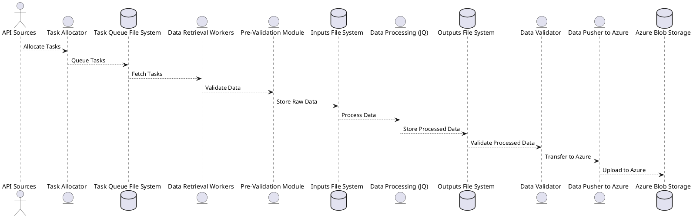

## Background

The development of this system is driven by a need to improve search functionalities across various business applications and data sources. As the business landscape evolves, there is a growing demand for integrating data from multiple sources including JIRA, SAP, Confluence, Teams, and Outlook, with expectations for further expansion. The system aims to enable powerful and efficient searching capabilities that overcome limitations found in current solutions like Elastic Search, especially regarding advanced search strategies such as cosine similarity. Additionally, the solution seeks to empower business partners with self-service capabilities for adding and managing their data, supporting a collaborative and flexible data ecosystem.

## Requirements

### Functional Requirements
- **Data Indexing**: The system must be able to fetch and index data from multiple sources, including but not limited to JIRA, SAP, Confluence, Teams, and Outlook.
- **Extensibility**: It should support adding new data sources easily as the list of sources grows.
- **Partner Integration**: Partners should be able to integrate their systems (e.g., JIRA, Teams) for data addition without extensive manual intervention, enabling a 'self-service' model.
- **Search Engine Flexibility**: While integrating with existing Elastic Search capabilities, the system must also support other search engines without needing to reindex data, to utilize advanced search techniques.

### Non-Functional Requirements
- **Cost Efficiency**: The architecture must minimize operational costs.
- **Reliability**: It should include robust error handling and retry mechanisms with back pressure.
- **Throttling**: The system must manage API rate limits to prevent source overload.
- **Infrastructure as Code**: All system configurations should be maintainable via code in a Git repository, ensuring repeatability and no manual setups.
- **Ease of Deployment**: The deployment process must be simple and repeatable, accommodating multiple instances of the system setup.
- **Data Utilization**: The indexed data should serve as a valuable data lake for other approved projects.
- **Scalability**: The system must scale horizontally to handle significant volumes of data from potentially 50,000 to 100,000 employees.

### Prioritization
- All specified functional and non-functional requirements are essential for the project and will be addressed in the proposed architecture.

# Architecture

